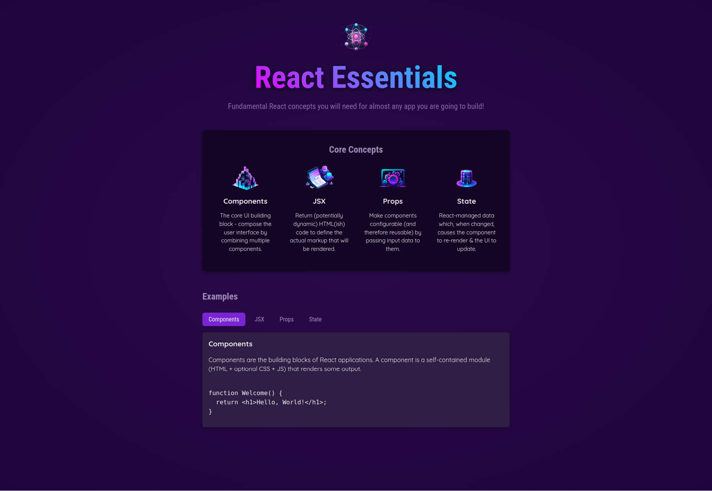

# React Essentials using React.js

I created this project as my initial foray into frontend development with React.js. The entire application was developed solely using React.js, without incorporating any other frameworks. I successfully completed this project with the excellent guidance of instructor Maximillian Schwarzmüller, as part of my learning experience in this course.

## To Boot Up the Project

1. Clone the project to your local machine: `git clone git@github.com:polaeskandar/project-react-essentials.git`.
2. Change into the project directory: `cd project-node-farm`.
3. Run the installation process: `npm install`.
4. Run the project: `npm run dev`.

## Feedback & Contact

If you have any feedback you would like to give regarding this project, please feel free to open a new issue in the issues tab. Alternatively, you can reach me through the following:

- LinkedIn: [@polaeskandar](https://www.linkedin.com/in/polaeskandar/)
- Business Email: pola.eskandar@codingstreamer.com
